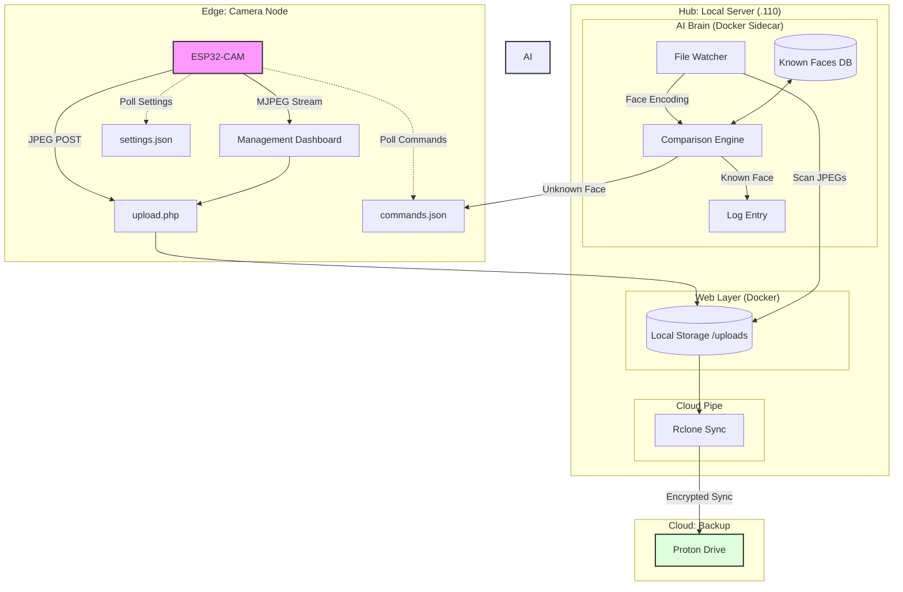

# 📷 ESP32-FR-Motion-Docker

A high-intelligence, distributed camera system that combines ESP32-CAM hardware with a local AI "Brain" for facial recognition and automatic cloud backup to Proton Drive.

## 🗺️ System Architecture



### How it Works:
1. **The Stream:** The ESP32 hosts a lightweight MJPEG stream that the Dashboard connects to for "Live View."
2. **The Detection:** The ESP32 sends images to `upload.php` on motion.
3. **The Brain:** The AI Brain container watches the `uploads` folder. It extracts face encodings and compares them to the `Known Faces` database.
4. **The Action:** If a face is **Unknown**, the Brain writes `RECORD_VIDEO` to `commands.json`. The ESP32 polls this file, sees the command, and captures a high-res clip.
5. **The Backup:** Every 15 minutes, Rclone mirrors the local `uploads` folder to Proton Drive for permanent, encrypted storage.

## 🚀 Key Features
- **Live View:** Low-latency MJPEG streaming directly to the browser.
- **Face-Aware Recording:** 
  - **Known Faces:** Logged but ignored.
  - **Unknown Faces:** Triggers a high-priority video recording request to the camera.
- **Remote Controls:** Adjust brightness, contrast, and resolution via the web UI.
- **Static IP Mesh:** Pre-configured for reliable local network connectivity.
- **Proton Drive Integration:** Automated sync of all captures to secure cloud storage.

## 🛠️ Installation & Setup

### 1. Server Deployment
Deploy the provided Docker stack via Portainer or CLI:
```bash
# Run from the lauch directory
docker compose up -d
```
- **Dashboard Access:** `http://<server-ip>:8787/demo_dashboard.html`

### 2. Face Database
1. Navigate to the **Face Database** tab on the dashboard.
2. Upload Photos of trusted people (e.g., `john.jpg`, `jane.jpg`).
3. The AI Brain will automatically encode these fingerprints for matching.

### 3. Cloud Configuration
Configure your Proton Drive credentials in `rclone.conf` (see `rclone.conf.example`).

### 4. Flashing the Camera
1. Open `esp32/esp32-cam-uploader.ino` in Arduino IDE.
2. Select board: `AI Thinker ESP32-CAM` or `Freenove WROVER-DEV`.
3. Update `CAM_ID` (e.g., `cam1`, `cam2`).
4. Flash and boot.

## 🖼️ Interface
*(Screenshots Placeholder)*
- **Live View:** [Image: Live streaming viewport with overlay controls]
- **Face Mgmt:** [Image: Grid of known faces with a "Add Trusted" upload area]
- **Controls:** [Image: Hardware setting sliders and Reboot buttons]

## 🛡️ Security & Privacy
- **Local-First:** All AI analysis happens on your own hardware (.110 server), not in the cloud.
- **Encrypted Backup:** Captures are sent to Proton Drive using end-to-end encrypted tunnels via Rclone.
- **Sane Defaults:** No public internet exposure unless you explicitly open ports on your router.
