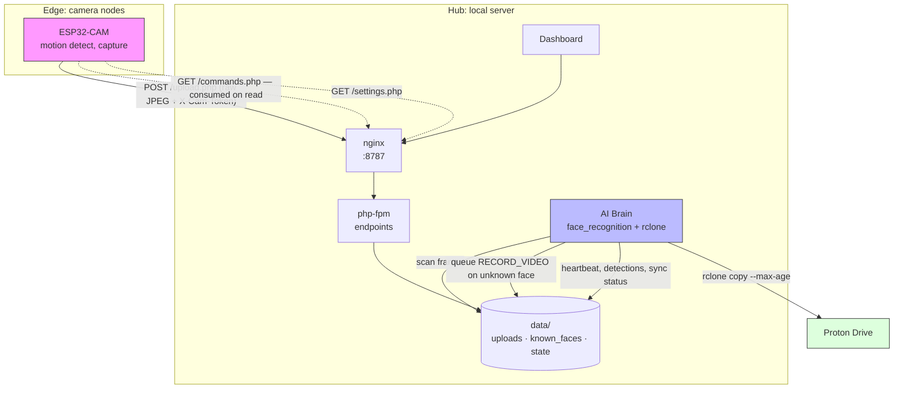

# ESP32-CAM Motion & Face Recognition

Motion-triggered ESP32-CAM capture with server-side face recognition and
encrypted off-site backup. Runs as a three-container Docker stack on a machine
on your own LAN.

## What it actually does

| Capability | Status |
|---|---|
| Motion-triggered JPEG upload, 1 fps idle / 5 fps active | Working |
| Web dashboard: multi-camera live view, motion timeline, fullscreen frames | Working |
| Face recognition against a known-faces database | Working |
| Unknown face triggers a high-rate capture burst on the camera | Working |
| Remote camera controls (brightness, contrast, resolution, sensitivity) | Working |
| Remote reboot and flash LED control | Working |
| Scheduled + manual rclone backup to Proton Drive | Working |
| Token auth on every endpoint | Working |
| On-device MJPEG streaming | **Removed** — see below |
| Video file recording to SD card | **Not implemented** |
| HTTPS | **Not implemented** — LAN only |

Two capabilities were advertised in earlier revisions of this README but did not
exist in the code. They are listed honestly above rather than quietly dropped:

- **MJPEG streaming** was removed. The handler emitted malformed HTTP (its CRLF
  escapes were double-escaped, so no browser could parse the response) and it
  blocked the firmware's main loop for the entire viewing session, which stopped
  motion uploads while anyone was watching. The dashboard now polls the latest
  uploaded frame instead, which yields the same ~5 fps during motion. Adding a
  real stream requires a dedicated FreeRTOS task on the second core.
- **Video recording** does not exist; these boards have no SD card in this
  build. `RECORD_VIDEO` instead triggers a 10-second burst of 5 fps frames,
  which the server archives as a motion event.

## Architecture



### Data flow

1. The camera captures a frame, compares its compressed size to a rolling
   baseline, and POSTs it to `upload.php` with a motion flag.
2. `upload.php` validates the JPEG, stores the latest frame atomically, and
   archives motion frames under `data/uploads/<camId>/`, pruning by count and age.
3. The brain scans new frames, encodes any faces, and compares them to the
   known-faces database using the *closest* match within tolerance.
4. An unknown face queues `RECORD_VIDEO` for that camera, rate-limited to one
   command per 30 seconds.
5. The camera collects the command on its next 2-second poll. The server deletes
   it as it is handed over, so each command fires exactly once.
6. Every 15 minutes (or on demand) the brain runs `rclone copy --max-age=24h` to
   Proton Drive.

## Requirements

- Docker with Compose v2
- Arduino IDE with **arduino-esp32 core ≥ 2.0.4**
- An rclone remote for Proton Drive (optional; backup is skipped if unset)

## Setup

### 1. Configure secrets

```bash
cp .env.example .env
openssl rand -hex 32   # paste into CAM_TOKEN
openssl rand -hex 32   # paste into ADMIN_TOKEN
```

Both tokens are mandatory. Every endpoint **fails closed with HTTP 500** while
they are unset — an unconfigured server never means "allow everyone".

- `CAM_TOKEN` — the cameras. Uploads, command polling, settings polling.
- `ADMIN_TOKEN` — the dashboard. Everything else. Never accepted from a camera,
  because the devices are physically accessible and their flash can be dumped.

### 2. Configure rclone

```bash
cp rclone.conf.example rclone.conf
# edit it, then confirm the remote name matches RCLONE_REMOTE in .env
```

Create this file **before** the first `docker compose up`, otherwise Docker
creates a directory in its place. To run without backup, leave `RCLONE_REMOTE`
empty; the dashboard will report backup as disabled rather than healthy.

### 3. Start the stack

```bash
docker compose up -d --build
```

The first build compiles dlib and takes several minutes. Subsequent starts are
instant, because dependencies are baked into the image rather than installed on
every restart.

Dashboard: `http://<server-ip>:8787/` — sign in with `ADMIN_TOKEN`.

### 4. Flash the cameras

```bash
cp esp32/secrets.h.example esp32/secrets.h
```

Edit `secrets.h`: WiFi credentials, `SERVER_IP`, `CAM_TOKEN` (must match `.env`),
and a unique `CAM_ID` per device. Set `BOARD_TYPE` at the top of the `.ino`
(`0` = AI Thinker, `1` = Freenove WROVER-DEV), then flash.

`secrets.h` is gitignored. Do not move credentials back into the sketch.

Wiring a CP2102 for flashing: `5V→5V`, `GND→GND`, `TXD→U0R`, `RXD→U0T`,
`IO0→GND`. Press RST when "Connecting..." appears, then remove `IO0→GND` and
press RST again to run.

### 5. Add known faces

Dashboard → **Face Database** → enter a name, choose a JPEG with one clearly
visible face. The brain re-reads the directory when it changes; no restart
required. With an empty database everyone is reported as Unknown, and every
detection triggers a burst.

## Endpoints

| Endpoint | Method | Auth | Purpose |
|---|---|---|---|
| `upload.php?camId=&motion=` | POST | cam | Receive a frame (raw JPEG body or multipart) |
| `commands.php?camId=` | GET | cam | Collect pending command, consumed on read |
| `commands.php?camId=&action=` | POST | admin | Queue `RECORD_VIDEO`/`REBOOT`/`FLASH_ON`/`FLASH_OFF` |
| `settings.php?camId=` | GET | cam or admin | Current sensor settings |
| `settings.php?camId=` | POST | admin | Update settings (values clamped server-side) |
| `cameras.php` | GET | admin | Camera list with liveness and motion state |
| `events.php?camId=&limit=` | GET | admin | Motion timeline |
| `frame.php?camId=[&event=]` | GET | admin | Latest or archived frame |
| `manage_faces.php?action=list` | GET | admin | Known faces |
| `manage_faces.php?action=add\|delete` | POST | admin | Add / remove a face |
| `face.php?name=` | GET | admin | Face thumbnail |
| `status.php` | GET | admin | Brain health, detections, backup state |
| `status.php?action=sync` | POST | admin | Request a backup run |
| `login.php` | GET/POST | — | Session for cookie-authenticated image loads |

Clients may authenticate with an `X-Cam-Token` / `X-Admin-Token` header. The
dashboard exchanges its token for a `SameSite=Strict` session cookie once, so
that `` tags can load frames. Cookie-authenticated mutations additionally
require an `X-Requested-With: esp32cam-dashboard` header as a CSRF guard.

## Security notes

- **Local-first.** Face recognition runs on your hardware. Nothing is sent
  anywhere except your own rclone remote.
- **Storage is outside the document root.** `data/` is reachable only through
  `frame.php` and `face.php`, so an uploaded file can never be served — or
  executed — directly. nginx additionally uses `try_files $uri =404` in the PHP
  location to close the classic path-info execution hole.
- **Uploads are validated** by magic bytes, `finfo`, and `getimagesizefromstring`.
  Stored filenames are always server-generated; the client never influences a
  path or an extension.
- **No TLS.** Frames and tokens cross the network in plaintext. Keep this on a
  trusted LAN. Do not port-forward `8787`; put a TLS-terminating reverse proxy
  in front of it first and set `SESSION_COOKIE_SECURE=1`.
- **Retention is enforced.** Motion frames are pruned by count
  (`MAX_EVENTS_PER_CAM`) and age (`MAX_EVENT_AGE_DAYS`). Without this a camera
  at 5 fps fills the disk.

### If you cloned this repo before the security fixes

Rotate anything you used with it. Earlier commits contain plaintext WiFi
credentials (including a third party's network), and `manage_faces.php`
permitted unauthenticated arbitrary file write, which was remotely exploitable
for code execution. Those credentials remain in git history; removing them from
the working tree does not revoke them.

## Troubleshooting

| Symptom | Cause |
|---|---|
| All endpoints return 500 "Server auth not configured" | `CAM_TOKEN` / `ADMIN_TOKEN` unset in `.env` |
| Camera uploads return 401 | `CAM_TOKEN` in `secrets.h` does not match `.env` |
| Dashboard shows "Face recognition: UNAVAILABLE" | dlib failed to build; check `docker compose logs brain` |
| Everyone is "Unknown" | Known-faces database is empty, or `FACE_TOLERANCE` is too strict |
| Backup reports "not configured" | `RCLONE_REMOTE` is empty in `.env` |
| No cameras listed | No frame has been accepted yet; check `docker compose logs nginx` for 401s |
| Sketch fails to compile on `pin_sccb_sda` | arduino-esp32 core older than 2.0.4 |

## Repository layout

```
docker-compose.yml       three services: nginx, php-fpm, brain
Dockerfile.brain         pinned build for dlib/face_recognition + rclone
requirements.txt         pinned Python dependencies
nginx.conf               routing and hardening
docker/php-custom.ini    PHP limits, open_basedir, disabled functions
brain_script.py          face recognition and backup loop
esp32/                   firmware + secrets template
server/public/           endpoints and dashboard
server/public/lib/        shared auth, validation, atomic-JSON helpers
data/                    created at runtime; gitignored
```
